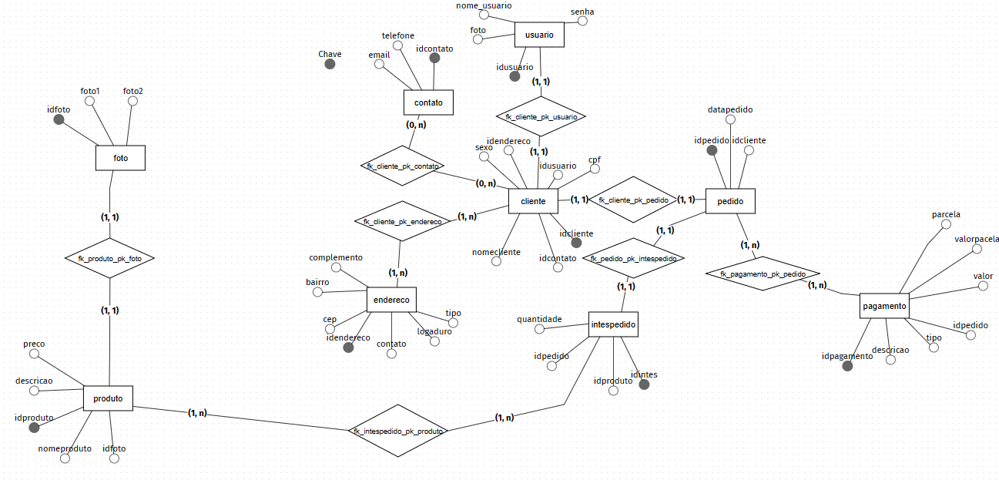
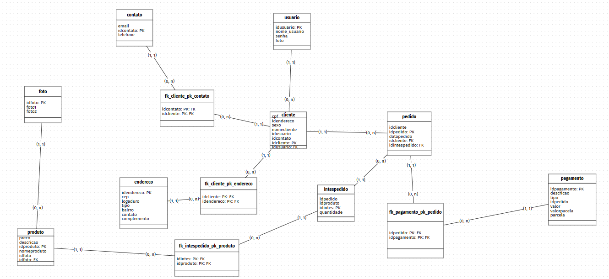

<h1 align="center"> Estudo_kibaratu 📚</h1>

Nesse caso, você aprenderá a montar um banco de dados usando uma loja fictícia de eletrônicos que gostaria de armazenar informações sobre seus clientes, compras, produtos e pagamentos. Gerenciar dados de forma a garantir a proteção das informações armazenadas.

<h3 ign="center"> Problemas a se solucionar <h3>

1 Fotos
  
2 Cliente

3 Contato

4 Endereço

5 Itens_pedidos

6 Pagamento

7 Produto

8 Usuário

<h1 align="center"> Modelagem conceitua do kibaratu 📚</h1>

<h2 lign="center"> ## descrição ✏️</h2>

A modelagem conceitual é uma técnica de modelagem de dados que permite a representação dos conceitos e das relações existentes entre eles, sem se preocupar com a forma como esses dados serão armazenados em um banco de dados específico. Ela é usada para capturar os requisitos de negócio e criar uma representação visual dos objetos do mundo real que serão armazenados no banco de dados. A modelagem conceitual é uma etapa importante no processo de desenvolvimento de software, pois fornece uma visão geral dos dados que serão manipulados pelo sistema, permitindo que os desenvolvedores projetem um modelo de banco de dados eficiente e escalável.
<h1 align="center"> Modelagem lógica 📚</h1>

<h2 lign="center"> descrição ✏️✏</h2>

Um modelo lógico é um tipo de modelo de dados que fornece uma descrição detalhada dos elementos de dados, e é utilizado para desenvolver uma compreensão visual das entidades de dados, seus atributos, chaves e relacionamentos. Esse modelo é uma representação abstrata e simplificada do mundo real, que permite que os desenvolvedores de software visualizem a estrutura dos dados e como eles estão organizados. Por meio do modelo lógico, é possível identificar as relações entre as entidades de dados, o que ajuda a criar um projeto de banco de dados mais coerente e eficiente.

