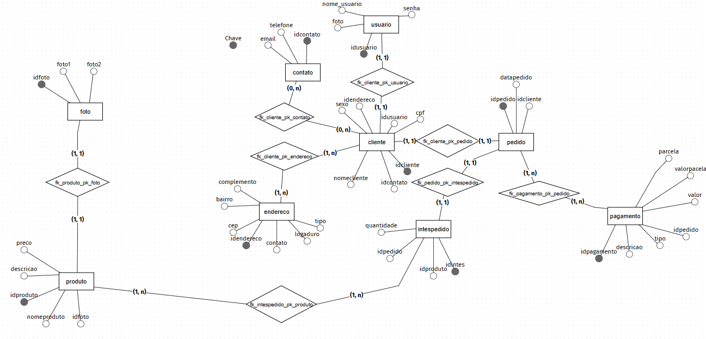

<h1 align="center"> Estudo_kibaratu 📚</h1>

Nesse caso, você aprenderá a montar um banco de dados usando uma loja fictícia de eletrônicos que gostaria de armazenar informações sobre seus clientes, compras, produtos e pagamentos. Gerenciar dados de forma a garantir a proteção das informações armazenadas.

<h1 align="center"> Criação de tabelas</h1>

1 Fotos
  
2 Cliente

3 Contato

4 Endereço

5 Itens_pedidos

6 Pagamento

7 Produto

8 Usuário

<h1 align="center"> Modelagem conceitua do kibaratu 📚</h1>

